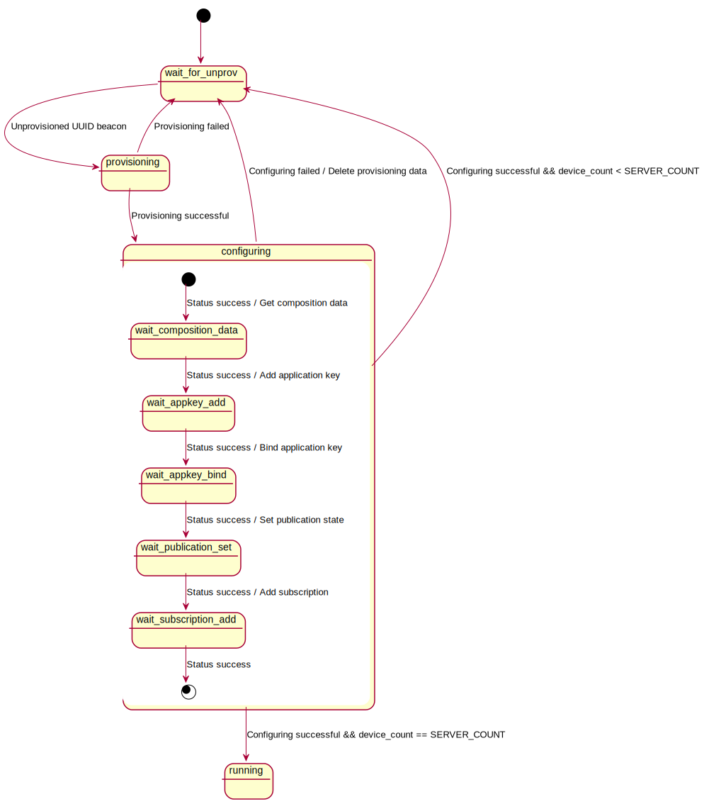

# Light switch demo

## Purpose

This demo project consists of two applications, the light switch client and server.
Its main purpose is to show how to develop applications with both provisioner and
provisionee roles. In addition, it demonstrates how to use custom models by using
the custom [Simple OnOff model](@ref md_models_simple_on_off_README) in
a real application.

## Getting started

### Hardware requirements

- One PCA10028 or PCA10040 development board for the client.
- Three development boards or dongles (PCA10028, PCA10031, or PCA10040) for the servers.

### Running the demo

1. Erase the existing software on the development boards and program them with the SoftDevice.
2. Flash one client and three servers.
3. After a reset, the client starts provisioning and configuring each of the servers, one by one.

The client indicates the provisioning and configuration progress with an active
status LED for the device it is configuring. When all the servers are provisioned and
configured, all four lights on the client blink rapidly.

After provisioning and configuration, press the buttons on the client to control
the LED on each of the servers. Buttons 1--3 set the LED on the individual servers.
Button 4 sets the LEDs on all the servers if any single LED is off, or turns the LEDs
off otherwise. If an RTT terminal is available and connected to the client, sending
the ASCII numbers `0`--`3` will have the same effect as pressing the buttons.

The LEDs on the client will mirror the state of the servers' LEDs.

If any of the devices are powered off and back on, they will remember their configuration
in flash and rejoin the network. More information about the flash manager can be found
in the [flash manager documentation](@ref md_doc_libraries_flash_manager).

## Details

For details about the provisioning and configuration process, see the [How to build a network](@ref md_doc_getting_started_how_to_build_your_network) guide.

### Light switch client

The *Light switch client* has the provisioner role in the network.
It is implemented as a multi-layered state machine due to the asynchronous nature of the provisioning and configuration process.
The following diagram shows the state transitions of the implementation.

For more information on how a provisioner works, see the [Mesh provisioning Guide](@ref md_doc_getting_started_provisioning).

### Light switch server

The *Light switch server* has the provisionee role in the network.

### Simple OnOff Client/Server

The Simple OnOff Client/Server is a simple proprietary model for manipulating an
on/off state. Note that when the server has a publish address set (as in this example),
the server will publish any operation of its state to its publish address.

More information about the Simple OnOff model can be found in the
[Simple OnOff model README](@ref md_models_simple_on_off_README)
and in [Creating Custom Models](@ref md_doc_getting_started_how_to_models).

